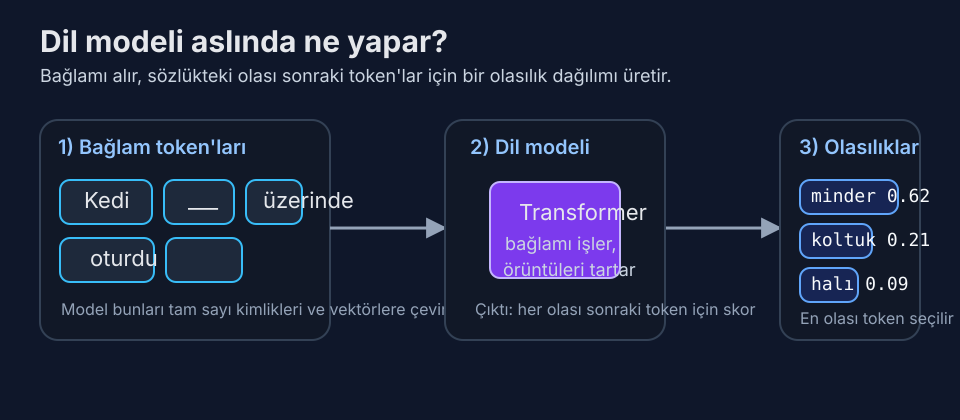

# Gün 1: Dil Modeli Nedir?

*1948'de kelime çiftlerini saymaktan insan dilinin geleceğini tahmin etmeye — konuşmayı öğrenen makinelerin beklenmedik yolculuğu.*

---

## Hiç Duymadığınız En Önemli Denklem

İşte üzerinde gerçekten düşününce hiç de basit olmayan bir soru: "Kedi ___ üzerinde oturdu" cümlesinde boşluğa ne gelir?

Muhtemelen "minder" dediniz. Belki "koltuk" ya da "halı." Beyniniz ezberlenmiş bir cevabı çekip almadı — olası tüm Türkçe kelimeler üzerinde bir *olasılık dağılımı* hesapladı, bunları dil deneyiminizle tartarak en muhtemel adayları öne çıkardı. Bunu milisaniyeler içinde, bilinçli bir çaba harcamadan yaptınız.

Bir **dil modeli**, aynı şeyi matematiksel olarak yapan bir sistemdir. Kelime dizilerine olasılıklar atar — daha doğrusu, önceki tüm token'lar verildiğinde bir sonraki token'a olasılık atar. Bu kadar. Fikrin tamamı bu. Konuştuğunuz her sohbet botu, kod ya da şiir ya da hukuki belge yazan her yapay zekâ, özünde çok sofistike bir sonraki-token tahmin edicisidir.

*Basit ama derin fikir: model “anlam” adlı ayrı bir modül çalıştırmaz; bağlamdan sonraki token olasılıklarını hesaplar.*

Ama o "bu kadar" ifadesi çok iş yapıyor. Naif bir kelime sayma yaklaşımıyla GPT-4 arasındaki fark, kâğıt uçakla Boeing 787 Dreamliner arasındaki fark gibidir. İkisi de uçar. Mühendislikleri bu kadar farklı olamaz.

> 💡 **Token nedir?** Bu kitap boyunca sürekli karşınıza çıkacak: *token*, modelin işlediği en küçük metin birimidir. Bazen bir kelimeye, bazen bir kelime parçasına, bazen tek bir karaktere karşılık gelir. "Tokenizasyon" konusunu Gün 5'te derinlemesine işleyeceğiz.

## Perde I: Kelimeleri Saymak (1948–2000)

Hikâye Claude Shannon ile başlıyor — evet, *o* Claude Shannon, bilgi teorisinin babası. 1948 tarihli çığır açıcı makalesi "İletişimin Matematiksel Teorisi"nde Shannon radikal bir şey önerdi: İngilizceyi istatistiksel bir süreç olarak modelleyebilirsiniz. Dil bilgisini ya da anlamı anlamaya gerek yok; sadece harflerin ve kelimelerin birbirini nasıl takip ettiğindeki örüntüleri gözlemleyerek.

Shannon bugün **n-gram modeli** diyeceğimiz şeyi inşa etti. Fikir zarif bir şekilde basittir. Devasa bir metin yığını alın. Her kelimenin diğer her kelimeden sonra ne sıklıkla geldiğini sayın. Bu size bir *bigram* modeli (n=2) verir. Her kelimenin her kelime *çiftinden* sonra ne sıklıkla geldiğini sayarsanız, bir *trigram* modeliniz (n=3) olur. Sonraki kelimenin olasılığı basitçe şudur:

> P(kelime | önceki n-1 kelime) = sayı(n-gram) / sayı((n-1)-gram)

Eğer "New York" korpusunuzda 10.000 kez, "New York City" ise 3.000 kez geçiyorsa, P(City | New York) = 0,3. Kolay.

N-gram modelleri doğal dil işleme alanına onlarca yıl hükmetti. Google'ın 2006'da yayınladığı Web 1T 5-gram korpusu, web sayfalarından elde edilen bir trilyondan fazla token içeriyordu — en az 40 kez geçen 1 ile 5 kelimelik her dizi. Bu modeller 2000'ler boyunca yazım denetleyicileri, makine çeviri sistemleri ve konuşma tanımayı güçlendirdi. IBM'in trigram dil modelleri kullanan istatistiksel makine çeviri sistemi, 2000'lerin başında kural tabanlı sistemleri ikna edici biçimde geçmişti.

Ama n-gram modellerinin acımasız bir sınırı vardı: **boyutluluk laneti**. Aktif kullanımda yaklaşık 170.000 İngilizce kelime var. Bir bigram modeli 170.000² ≈ 29 milyar kelime çifti için olasılık depolamak zorundadır. Trigram modeli: 170.000³ ≈ 4,9 × 10¹⁵ kayıt. 5-gram modeli mi? Unutun — Google'ın trilyon token'lık korpusu bile olası 5-gramların çoğunu tam olarak sıfır sayısıyla bırakıyordu.

Buna **seyreklik problemi** denir. Makul cümlelerin çoğu, eğitim korpusu ne kadar büyük olursa olsun, hiçbirinde daha önce görülmemiş kelime dizileri içerir. "Kuantum fizikçisi burritosunu silip süpürdü" gayet geçerli bir Türkçe cümledir, ama herhangi bir korpusta bunu bulmaya çalışın bakalım. N-gram modelleri buna sıfır olasılık atar ki bu açıkça yanlıştır.

Araştırmacılar bunu **düzleştirme teknikleriyle** yamaladılar — Kneser-Ney düzleştirmesi, Good-Turing tahmini, "aptal geri dönüş" (evet, gerçek adı bu, Google'ın 2007'deki icadı). Bu hileler olasılık kütlesini yaygın n-gramlardan nadir ya da hiç görülmemiş olanlara yeniden dağıtıyordu. Şaşırtıcı derecede iyi çalıştılar. Ama temeldeki bir sorun için yama niteliğindelerdi: n-gram modelleri kelimeleri birbirleriyle hiçbir ilişkisi olmayan keyfi semboller olarak ele alıyordu. Model, "yuttu" ile "yedi"nin ilişkili olduğundan ya da "fizikçi" ile "bilim insanı"nın anlam paylaştığından habersizdi.

## Perde II: Makinelere Kelimelerin Anlam Taşıdığını Öğretmek (2003–2017)

2003 yılında Montreal Üniversitesi'nden Yoshua Bengio ve meslektaşları, alanı sessizce yeniden şekillendirecek bir makale yayınladı: "Sinirsel Olasılıksal Dil Modeli." Temel kavrayış yanıltıcı biçimde basitti: ya her kelimeyi izole bir sembol olarak ele almak yerine, kelimeleri *vektörler* — sürekli bir matematiksel uzaydaki noktalar — olarak temsil etsek?

Bengio'nun modeli üç bileşenden oluşuyordu: her kelimeyi (diyelim ki) 60 boyutlu bir vektöre eşleyen bir gömme katmanı, bağlam kelime vektörlerini birleştiren bir gizli katman ve sonraki kelimeyi tahmin eden bir çıktı katmanı. Gömme vektörleri elle tasarlanmamıştı — eğitim sırasında *öğrenilmişlerdi*. Benzer bağlamlarda geçen kelimeler, vektör uzayında yavaş yavaş birbirine yakın konumlara sürüklendi.

Bu, seyreklik problemini tek hamlede çözdü. Model "Kuantum fizikçisi burritosunu silip süpürdü" cümlesini hiç görmemiş olsa bile, "Nükleer fizikçi sandviçini yedi" cümlesinden genelleme yapabilirdi, çünkü "kuantum" ve "nükleer" benzer gömmelere sahip olacaktı — tıpkı "silip süpürdü"/"yedi" ve "burrito"/"sandviç" gibi.

Model, modern standartlara göre minnacıktı — belki 17.000 kelimelik bir sözlük, 14 milyon token metin üzerinde eğitilmişti. Eğitim tek bir makinede günler sürdü. Ama düzleştirmeli en iyi n-gram modellerini şaşkınlık (perplexity) ölçütlerinde geçti, hem de büyüklük sıraları daha az veri kullanarak.

Bengio'nun modeli bir *ileri beslemeli* sinir ağıydı — sabit bir penceredeki önceki kelimelere (tipik olarak 5-10) bakıyordu. Bu, uzun menzilli bağımlılıkları yakalayamayacağı anlamına geliyordu. Cümlenin öznesi 20 kelime öncesindeyse, şansınız yok.

Sahneye **yinelemeli sinir ağları (RNN'ler)**, ve özellikle Sepp Hochreiter ile Jürgen Schmidhuber'in 1997'de icat ettiği **Uzun Kısa Süreli Bellek (LSTM)** ağları giriyor. LSTM'ler metni kelime kelime işleyerek bir gizli durum — bir tür süregelen özet — tutarlar ve bu teorik olarak bilginin süresiz kalmasını sağlar. Pratikte LSTM'ler sinyal bozulmadan önce belki 200-300 token'lık bağımlılıkları idare edebiliyordu.

2015-2016 itibariyle LSTM dil modelleri en ileri düzeyi temsil ediyordu. Google Brain'den Rafal Jozefowicz ve meslektaşları, katman başına 8.192 gizli birime sahip iki katmanlı bir LSTM eğitti — yaklaşık 1,04 milyar parametre — One Billion Word Benchmark üzerinde. 30,0'lık bir şaşkınlık (perplexity) değeri elde etti; bu, modelin ortalamada 30 eşit olasılıklı sonraki kelime arasından seçim yapıyormuş kadar belirsiz olduğu anlamına geliyor. Karşılaştırma için: 800.000 kelimelik bir sözlük üzerinde rastgele tahmin yapan bir modelin şaşkınlık değeri 800.000 olurdu. LSTM alanı dört büyüklük sırası daraltıyordu.

Ama LSTM'lerin de kendi Aşil topuğu vardı: **sıralıydılar**. Kelime 500'ü işlemek için önce kelime 1'den 499'a kadar hepsini işlemeniz gerekiyordu. Dizi boyunca paralelleştirme yapamazdınız. Bu, büyük veri kümeleri üzerinde eğitimi acı verici derecede yavaşlatıyordu. Google'ın milyar parametreli LSTM'si bir GPU kümesinde eğitilmesi haftalar aldı. Daha iyi bir yol olmalıydı.

## Perde III: Devrim (2017–Günümüz)

Vardı. Haziran 2017'de Google'da sekiz araştırmacıdan oluşan bir ekip "Attention Is All You Need" (İhtiyacınız Olan Tek Şey Dikkat) makalesini yayınladı. Makale **Transformer** mimarisini tanıttı ve iki yıl içinde dil modelleme için LSTM'leri esasen geçersiz kıldı.

Transformer'ları Gün 3 ve 4'te derinlemesine inceleyeceğiz. Şimdilik kilit kavrayış şu: Transformer, kelimeleri sırayla işlemek yerine dizideki tüm kelimeleri *aynı anda* işler; **öz-dikkat** (self-attention) adlı bir mekanizma kullanarak her kelimenin diğer her kelimeye "bakmasına" ve ona ne kadar önem vereceğine karar vermesine olanak tanır. Bu, muazzam ölçüde paralelleştirilebilir — yüzlerce GPU atabilirsiniz ve hepsi meşgul kalır. Hız avantajı dönüştürücüdür (kelime oyunu kaçınılmaz).

Transformer basit ama güçlü bir reçetenin kilidini açtı: *çok büyük* bir sinir ağı al, *çok büyük* miktarda metin üzerinde eğit, tek hedef olarak sonraki-token tahmini kullan. GPT-1 (2018) 117 milyon parametreye sahipti ve BookCorpus (yaklaşık 800 milyon token) üzerinde eğitilmişti. GPT-2 (2019) 1,5 milyar parametreye ve 40 GB web metnine ölçeklendi. GPT-3 (2020) 175 milyar parametreye sıçradı ve 300 milyar token üzerinde, tahmini 4,6 milyon dolarlık hesaplama maliyetiyle eğitildi.

Ölçekleme merdiveninde her basamak, kimsenin açıkça programlamadığı niteliksel yetenek değişiklikleri getirdi. GPT-3 makale yazabilir, diller arasında çeviri yapabilir, aritmetik yapabilir, kod yazabilir ve bilgi sorularını yanıtlayabilirdi — hepsi *yalnızca* sonraki token'ı tahmin etmek için eğitilmiş bir modelden. OpenAI'daki araştırmacılar bir çeviri modülü ya da matematik modülü inşa etmediler. Daha iyi bir dil modeli inşa ettiler ve bu yetenekler *kendiliğinden ortaya çıktı*.

İşte hâlâ insanları şaşırtan sezgiye aykırı kısım: **sonraki-token tahmini sığ bir görev değildir**. Organik kimya hakkındaki bir metinde sonraki token'ı tahmin etmek için modelin dolaylı olarak organik kimya öğrenmesi gerekir. Cebirsel notasyonla yazılmış bir satranç oyunundaki sonraki hamleyi tahmin etmek için dolaylı olarak satranç stratejisi öğrenmesi gerekir. Kodun sonraki satırını tahmin etmek için dolaylı olarak programlama öğrenmesi gerekir. Tahmin hedefi sığdır; bunu iyi yapmak için gereken bilgi değildir.

Buna bazen **sıkıştırma hipotezi** denir: metnin yeterince iyi bir sıkıştırıcısı, o metni üreten süreçlerin bir modelini öğrenmek zorundadır. Eğitim veriniz milyonlarca fizik ders kitabı içeriyorsa, fizik tartışmalarında sonraki kelimeyi tahmin etmek fizik öğrenmeyi gerektirir. Dil modeli bir bakıma insan bilgisinin *sıkıştırılmış bir temsili* haline gelir — bu bilgiyi nasıl ifade ettiğimizin istatistiksel düzenlilikleri aracılığıyla süzülmüş olarak.

## "Olasılık" Aslında Neye Benzer

Somutlaştıralım. Claude ya da GPT-4 gibi modern bir dil modeli "Fransa'nın başkenti" girdisini işlediğinde, son katmanı yaklaşık 100.000-200.000 sayıdan oluşan bir vektör üretir (sözlükteki her token için bir tane). Bu sayılar, softmax fonksiyonu uygulandıktan sonra olasılıklara dönüşür. Çıktı yaklaşık şöyle görünebilir:

| Token | Olasılık |
|-------|----------|
| Paris | 0,92 |
| olan | 0,03 |
| bilinen | 0,01 |
| bulunan | 0,008 |
| bir | 0,005 |
| ... | ... |

Model, Paris'in Fransa'nın başkenti olduğunu sizin bildiğiniz şekilde "bilmez." Eğitim metninin engin okyanusunda "Paris"in "Fransa'nın başkenti"nden sonra ezici çoğunlukla geldiğini öğrenmiştir. Ama bu istatistiksel öğrenme o kadar derindir ki "bilmek" ile "tahmin etmek" arasındaki ayrım bulanıklaşmaya başlar.

**Sıcaklık** (temperature), bu dağılımdan örneklemenin rastgeleliğini kontrol etme yöntemimizdir. Sıcaklık 0'da model her zaman en yüksek olasılıklı token'ı seçer (açgözlü kod çözme). Sıcaklık 1'de olasılıklarla orantılı örnekleme yapar. Sıcaklık 2'de dağılım düzleşir — "Paris" 0,6'ya düşebilirken düşük olasılıklı token'lar güçlenir. Bu yüzden yaratıcı yazım görevlerinde genellikle yüksek sıcaklık (daha şaşırtıcı kelime seçimleri), olgusal görevlerde ise düşük sıcaklık (en muhtemel olana sadık kal) kullanılır.

## Bir Dil Modelini Ölçmek: Şaşkınlık (Perplexity)

Bir dil modelinin diğerinden daha iyi olup olmadığını nasıl ölçersiniz? Standart metrik **şaşkınlık** (perplexity) değeridir ve güzel bir sezgiselliği vardır.

Şaşkınlık, çapraz entropi kaybının 2'nin üssü olarak ifadesidir. Günlük dilde: şaşkınlık, modelin her adımda ortalama kaç eşit olasılıklı token arasından seçim yaptığını söyler. 10'luk şaşkınlık, modelin her token'da 10 yüzlü bir zar atıyormuş kadar belirsiz olduğu anlamına gelir. Düşük olan daha iyidir.

Bağlam için: standart ölçütlerde en iyi n-gram modelleri yaklaşık 50-70 şaşkınlık değerine ulaşıyordu. LSTM modelleri bunu 25-35'e indirdi. Modern Transformer tabanlı modeller birçok ölçütte 10'un altında şaşkınlık değerine ulaşıyor. GPT-4 sınıfı modellerin web metni üzerinde 4-6 civarında şaşkınlık değerine sahip olduğu tahmin ediliyor — yani tipik olarak sadece 4-6 makul sonraki token arasından seçim yapıyorlar. Bu şaşırtıcı derecede doğru.

Ama kritik bir nüans var: **şaşkınlık zekâyı ölçmez**. Wikipedia'nın tamamını ezberlemiş bir model, Wikipedia test setinde mükemmel şaşkınlık değerine sahip olabilir ama yeni bir soruyu yanıtlayamaz. Şaşkınlık, bir modelin metin dağılımlarını ne kadar iyi tahmin ettiğini ölçer; ne kadar iyi muhakeme yaptığını, talimatları takip ettiğini ya da zararlı çıktılardan kaçındığını değil. Tahmin kalitesi ile kullanışlı davranış arasındaki bu uçurum, ince ayar ve hizalamanın (2. Haftada işleyeceğimiz konular) neden bu kadar önemli olduğunun sebebidir.

## Ölçeğin Şaşırtıcı Gücü

Dil modelleri hakkındaki belki de en çarpıcı gerçek şudur: **ölçek her şeyi değiştirir**. 2020'de OpenAI'daki Jared Kaplan ve meslektaşları, model performansı ile üç değişken arasında olağanüstü temiz matematiksel ilişkiler keşfetti: parametre sayısı, veri kümesi boyutu ve hesaplama bütçesi. Bu **ölçekleme yasaları** (Gün 7'de derinlemesine inceleyeceğiz), dil modeli kaybının her değişkenle birçok büyüklük sırası boyunca düzgün bir kuvvet yasası olarak azaldığını gösterdi.

Bu, performansın *öngörülebilir* olduğu anlamına geliyor. 1 milyar parametreli bir modelin nasıl performans gösterdiğini biliyorsanız, 100 milyar parametreye şaşırtıcı doğrulukla ekstrapolasyon yapabilirsiniz. Ölçekleme eğrileri o kadar temiz ki OpenAI'ın GPT-4'ün performansını eğitim başlamadan önce tahmin etmek için bunları kullandığı bildirildi — hesaplama maliyeti 100 milyon doların üzerinde bir bahis.

2026 başı itibariyle, öncü modellerin (GPT-4.5, Claude 3.5, Gemini Ultra) 200 milyar ile 1,8 trilyon parametre arasında olduğu tahmin ediliyor ve 10-15 trilyon token metin üzerinde eğitildiler. Bu modellerin eğitim süreçleri yalnızca hesaplama maliyeti olarak 50-200 milyon dolara mal oluyor, 10.000-30.000 GPU'luk kümelerde 3-6 ay sürüyor ve küçük bir kasabayı bir yıl boyunca aydınlatmaya yetecek kadar elektrik tüketiyor.

Ve yine de, matematiksel özlerinde, hâlâ Claude Shannon'ın 1948'de tarif ettiği şeyin aynısını yapıyorlar: sırada ne geleceğini tahmin etmek.

---

## Temel Çıkarımlar

1. **Bir dil modeli, token dizilerine olasılıklar atar** — temel görev sonraki-token tahminidir
2. **N-gram modelleri** kelime dizilerini sayıyordu ama dilin kombinatorik patlamasını kaldıramadı
3. **Sinirsel dil modelleri** sürekli vektör uzaylarında kelime gömmeleri öğrenerek seyrekliği çözdü
4. **Transformer** (2017) muazzam paralelleştirmeyi mümkün kılarak RNN'lerle imkânsız olan ölçeği serbest bıraktı
5. **Sonraki token'ı iyi tahmin etmek derin dünya bilgisi gerektirir** — hedefin sadeliği öğrenmenin karmaşıklığını gizler
6. **Şaşkınlık** tahmin kalitesini ölçer ama kullanışlılığı ya da zekâyı değil
7. **Ölçekleme yasaları** büyük modellerin temiz kuvvet yasalarını takip ederek öngörülebilir biçimde daha iyi hale geldiğini gösterir

---

## Yarın: Anlamın Geometrisi

Dil modelleri kelimeleri vektörler olarak temsil ediyorsa, bu vektörler neye benzer? Gün 2, **kelime gömmelerini** — kelime vektörleri üzerindeki matematiksel işlemlerin gerçek anlamsal ilişkileri yakaladığı keşfini — derinlemesine inceliyor. `kral - erkek + kadın = kraliçe` denkleminin neden sadece şirin bir numara değil, anlamın geometride nasıl kodlanabileceğine dair derin bir kavrayış olduğunu ve Word2Vec ile GloVe'un modern LLM'lerin hâlâ üzerine inşa ettiği matematiksel temeli nasıl attığını keşfedeceğiz.

---

<link rel="stylesheet" href="../quiz/style.css">

