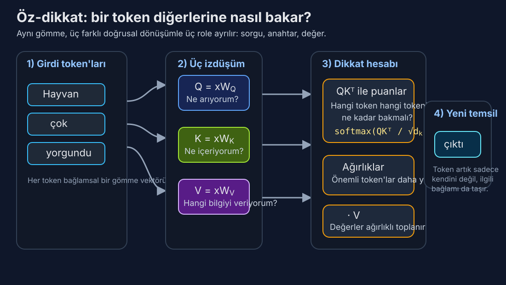

# Gün 3: Dikkat Mekanizması — Modeller Neye Odaklanacağını Nasıl Öğrenir

*Bir cümle okuyan sinir ağı, eskiden bir romanı anahtar deliğinden hatırlamaya çalışan birine benziyordu. Dikkat ona gözler verdi — ve her şeye aynı anda bakma yeteneği.*

---

## Nöronal Çeviriyi Neredeyse Öldüren Darboğaz

Dikkatin neden önemli olduğunu anlamak için, ondan öncekinin acısını hissetmeniz gerekiyor.

2014 itibariyle nöronal makine çevirisi bir şekilde çalışıyordu. Egemen mimari kodlayıcı-kod çözücüydü: bir kodlayıcı ağ (tipik olarak LSTM ya da GRU) kaynak cümleyi kelime kelime okuyarak tek bir sabit uzunluklu vektöre — genellikle 256 ya da 512 boyut — sıkıştırırdı; sonra bir kod çözücü ağ bu vektörü tek tek kelimelerle çeviriye geri açardı.

Bunun modelden ne istediğini düşünün. "Avrupa Parlamentosu, komisyonun yakın zamanda önerdiği ekonomik önlemi onaylamıyor" — 11 kelimelik bir cümleyi — anlam nüanslarının her birini, her dilbilgisel ilişkiyi, her bilgi parçasını 512 sayılık tek bir listeye sıkıştırıyorsunuz. Sonra da tamamını Fransızcada yeniden inşa etmeniz gerekiyor.

Bu, bir fotoğrafı tek bir cümle fısıldayarak birine anlattırıp resmetmesini istemeye benzer. Kısa cümleler için iyi. Ama girdi uzunluğu 20-30 kelimeyi aştıkça, BLEU puanları (çeviri kalitesinin standart metriği) uçurumdan düşüyordu. Ilya Sutskever'in çığır açıcı 2014 seq2seq makalesi yaklaşımın prensipte işe yaradığını gösterdi, ama darboğaz acımasızdı. Sabit uzunluklu vektör yeterince bilgi tutamıyordu.

Bu, bilgi darboğazı problemiydi ve diziden diziye öğrenmenin merkezi sıkıntısıydı.

## Bahdanau'nun Atılımı: Nereye Bakacağını Öğrenmek

Eylül 2014'te Dzmitry Bahdanau, Kyunghyun Cho ve Yoshua Bengio, yanıltıcı derecede mütevazı bir başlığa sahip bir makale yayınladı: "Birlikte Hizalamayı ve Çevirmeyi Öğrenerek Nöronal Makine Çevirisi." Geri yayılımdan bu yana derin öğrenmedeki en önemli fikri içeriyordu.

Kavrayışları neredeyse utandırıcı derecede basitti: *ya tüm girdiyi tek bir vektöre sıkıştırmak yerine, kod çözücü her adımda girdiye geri bakabilseydi?*

İşleyişi şöyle. Kodlayıcı hâlâ kaynak cümlenin tamamını işliyor, ama artık tüm ara gizli durumlarını saklıyor — her girdi kelimesi için bir tane. Kod çözücü çevirinin *t*. kelimesini üretirken, kendi mevcut durumu ile *her* kodlayıcı gizli durumu arasında bir puan hesaplıyor. Bu puanlar softmax ile bir olasılık dağılımına normalize ediliyor ve **dikkat ağırlıkları** oluşturuyor: 0 ile 1 arasında, toplamı 1 olan sayılar dizisi, modele her girdi kelimesine ne kadar "dikkat etmesi" gerektiğini söylüyor.

Kod çözücü daha sonra kodlayıcı durumlarının ağırlıklı ortalamasını alıyor — ilgili kelimelere daha çok, ilgisiz olanlara daha az dikkat ederek — bu kod çözme adımına özel bir **bağlam vektörü** üretiyor. Her çıktı kelimesi, girdinin kendine özgü bir görünümünü alıyor.

Matematiksel çekirdek bir peçeteye yazılabilecek kadar basit:

**puan(s_t, h_i)** = girdi konumu *i*, çıktı kelimesi *t*'yi üretmek için ne kadar ilgili

**α_ti** = softmax(puan(s_t, h_i)) — dikkat ağırlığı

**bağlam_t** = Σ α_ti · h_i — ağırlıklı toplam

Sihir, bu puanların *öğrenilmiş* olmasında. Ağ, milyonlarca cümle çifti üzerinde gradyan inişi ile hangi girdi kelimelerinin hangi çıktı kelimeleri için önemli olduğunu çözüyor. Tamamen kendi başına, üçüncü Fransızca kelimeyi çevirirken ikinci İngilizce kelimeye yoğun odaklanması gerektiğini keşfediyor. Hizalamayı — kaynak ve hedef kelimeler arasındaki eşlemeyi — iyi çeviri yapmanın bir *yan etkisi* olarak öğreniyor.

Sonuçlar hemen ve çarpıcıydı. İngilizceden Fransızcaya çeviride, dikkat modeli kısa cümlelerde dikkatsiz referans çizgisiyle eşleşti ama uzun cümlelerde ezdi — tam olarak darboğazın en cezalandırıcı olduğu alan. Performans artık cümle uzunluğuyla düşmüyordu. Bilgi darboğazı kırılmıştı.

Ama en güzel kısım yorumlanabilirlikti. Dikkat ağırlıklarını bir ısı haritası olarak görselleştirebilirdiniz — bir eksende kaynak kelimeler, diğerinde hedef kelimeler — ve modelin öğrendiği hizalamayı görebilirdiniz. Benzer kelime sırasına sahip dil çiftleri için temiz diyagonal desenler (kelime 1 → kelime 1, kelime 2 → kelime 2) ve kelime sırasının farklılaştığı çiftler — İngilizce-Japonca gibi — için öğrenilmiş çapraz desenler gösteriyordu. Model ham veriden dilbilimi yeniden keşfediyordu.

> 💡 **BLEU puanı nedir?** Bilingual Evaluation Understudy — makine çevirisinin kalitesini insan referans çevirisiyle karşılaştırarak ölçen otomatik bir metrik. 0-100 arasında değer alır; insan çevirmenler bile genellikle tam puan almaz.

## Yumuşak Bakıştan Lazer Odağa: Varyantlar

Bahdanau'nun "toplamsal" dikkati, kod çözücü durumu ve kodlayıcı durumunu küçük bir sinir ağından geçirerek puanları hesaplıyordu. 2015'te Minh-Thang Luong bunu "çarpımsal" dikkatle basitleştirdi: iki vektörün iç çarpımını al, o kadar. İki vektör gömme uzayında benzer yönleri gösteriyorsa, iç çarpımları yüksek olur — böylece puan doğal olarak anlamsal benzerliği yakalar.

Bu daha hızlıydı ve aynı derecede iyi çalışıyordu. Kavramsal bir tohum da ekti: dikkat temelde *eşleştirme* ile ilgilidir. Bir sorgunuz var (ne arıyorum?) ve bir aday kümeniz (ne mevcut?) ve her adayın sorguya ne kadar iyi uyduğunu hesaplıyorsunuz.

Farklı araştırmacılar varyasyonları keşfetti: yerel dikkat (sadece yakın kelimelerin penceresine bak), sert dikkat (yumuşak bir karışım yerine tam olarak bir kelime seç) ve hiyerarşik dikkat (önce cümlelere, sonra cümle içindeki kelimelere dikkat et). Ama çekirdek fikir — öğrenilmiş, türevlenebilir, ağırlıklı bellek erişimi — sağlam kaldı.

2016 itibariyle dikkat standart bir bileşen haline gelmişti. LSTM'lerin ve GRU'ların üzerine çeşni gibi serpiliyordu. Herkes yardımcı olduğu konusunda hemfikirdi. Ama hâlâ yinelemeli ağlara bir *eklentiydi*; yapısal omurga onlar olmaya devam ediyordu. Yinelemeli ağlar kelimeleri hâlâ teker teker, soldan sağa, adım adım işliyordu.

Ya omurgayı tamamen çıkarabilseydiniz?

## Öz-Dikkat: Kavramsal Sıçrayış

İşte her şeyi değiştiren fikir: ya bir cümle *kendisine* dikkat edebilseydi?

Bahdanau'nun orijinal formülasyonunda dikkat çapraz-dikkatti — kod çözücünün kodlayıcıya dikkat etmesi. Ama Haziran 2017'de Google'daki sekiz araştırmacıdan oluşan bir ekip — Ashish Vaswani, Noam Shazeer, Niki Parmar, Jakob Uszkoreit, Llion Jones, Aidan Gomez, Łukasz Kaiser ve Illia Polosukhin — "Attention Is All You Need" makalesini yayınladı ve **öz-dikkati** tanıttı: bir cümledeki her kelimenin *aynı* cümledeki diğer her kelimeye dikkat etmesini sağlamak.

Şu cümleyi düşünün: "Hayvan karşıya geçmedi çünkü o çok yorgundu." "O" neyi ifade ediyor? Hayvanı. Nasıl biliyorsunuz? Çünkü "yorgun" bir sokak için değil, bir hayvan için daha anlamlı bir özellik. İnsan bunu bağlamsal muhakemeyle anında çözer — aynı anda birden fazla kelimeyi zihinde tutarak hangi yorumun tutarlı olduğunu kontrol edersiniz.

Öz-dikkat bir sinir ağının tam olarak bunu yapmasını sağlar. Her kelime diğer her kelimeye bakıp sorabilir: "Bu bağlamda *beni* anlamak için sen ne kadar ilgilisin?" "O" kelimesi aynı anda "hayvan"a ve "yorgun"a güçlü biçimde dikkat edebilir ve hayvana atıfta bulunduğunu kodlayan bir temsil oluşturabilir.

Öz-dikkat öncesinde bu tür uzun menzilli bağımlılıklar nöronal dil modellerinin Aşil topuğuydu. Yinelemeli bir ağda, cümlenin başındaki bilgi düzinelerce sıralı adımdan geçerek hayatta kalmak zorundaydı, her birinde biraz daha bulanıklaşarak. LSTM 10. konumdaki "yorgun"a ulaştığında, 2. konumdaki "hayvan"dan gelen sinyal 8 darboğaz dönüşümünden sıkıştırılmış oluyordu. Öz-dikkat onları doğrudan bağlar — 10. konum mesafe fark etmeksizin tek bir adımda doğrudan 2. konuma bakabilir.

Bu sadece artımsal bir iyileştirme değil. Temelden farklı bir hesaplama paradigması. Yineleme sıralıdır: kelime 5, kelime 4'e bağlıdır, o da kelime 3'e. Öz-dikkat paraleldir: her kelime diğer her kelimeyle aynı anda konuşur. Binlerce çekirdeğe sahip bir GPU'da bu fark dönüştürücüdür.

## Sorgular, Anahtarlar ve Değerler: Mekanizma

Vaswani ekibi öz-dikkati, bilgi erişiminden ödünç alınmış zarif bir soyutlamayla resmileştirdi: **sorgular**, **anahtarlar** ve **değerler**.

Bir kütüphane düşünün. İçeri bir *sorgu* ile giriyorsunuz — yanıtlanmasını istediğiniz bir soru. Her kitabın sırtında bir başlık var — içindekileri özetleyen bir *anahtar*. Ve her kitap içerik barındırır — *değer*. İlgili bilgiyi bulmak için sorgunuzu her anahtarla karşılaştırır, hangilerinin en iyi eşleştiğini bulur ve öncelikle o kitaplardan okursunuz.

Öz-dikkat aynı şekilde çalışır, ama her kelime üç rolü de aynı anda oynar:

1. **Sorgu (Q):** "Ne arıyorum?" — kelimenin gömmesi öğrenilmiş bir ağırlık matrisi W_Q ile çarpılarak türetilir.
2. **Anahtar (K):** "Ne içeriyorum?" — farklı bir öğrenilmiş ağırlık matrisi W_K ile çarpılarak türetilir.
3. **Değer (V):** "Aslında hangi bilgiyi sağlıyorum?" — üçüncü bir matris W_V ile türetilir.

Kelime *i* ile kelime *j* arasındaki dikkat puanı, kelime *i*'nin sorgusu ile kelime *j*'nin anahtarının iç çarpımıdır: Q_i · K_j. Yüksek iç çarpım "kelime *j*, kelime *i*'nin aradığına sahip" demek. Bu puanlar ölçeklenir (√d_k'ye bölünür, d_k anahtar vektörlerinin boyutu — tipik olarak 64) ve softmax ile ağırlıklara dönüştürülür, ardından değer vektörlerinin ağırlıklı toplamını almak için kullanılır.

Tam formül:

**Dikkat(Q, K, V) = softmax(QK^T / √d_k) · V**

Bu kadar. GPT-4'ü, Claude'u, Gemini'yi ve 2026'daki hemen hemen her öncü yapay zekâ sistemini güçlendiren denklem bu. Tek bir satıra sığıyor.

√d_k ölçekleme faktörü ince ama kritik bir ayrıntı. Bu olmadan, d_k büyük olduğunda iç çarpımlar büyük değerlere sahip olma eğiliminde, softmax'ı son derece küçük gradyan bölgelerine iterek dikkati "fazla keskinleştirip" eğitim sırasında gradyan akışını öldürür. √d_k'ye bölmek iç çarpımların varyansını yönetilebilir düzeyde tutar. Bu, insanların gözden kaçırdığı ama eğitilen bir modelle eğitilemeyen model arasındaki farkı yaratan küçük mühendislik seçimlerinden biri.

*Buradaki ana fikir şu: aynı token gömmesi üç farklı öğrenilmiş mercekten geçer. Sorgu ne aradığını, anahtar ne sunduğunu, değer ise gerçekten taşınacak bilgiyi temsil eder.*

## Çok Başlı Dikkat: Sekiz Göz Birden İyidir

Vaswani makalesinden sezgiye aykırı bir kavrayış: tek bir dikkat işlemi yetmez. Bir Q, K, V matrisi seti aynı anda yalnızca bir tür ilişkiyi yakalayabilir — belki sözdizimsel yapı ya da belki anlamsal benzerlik, ama ikisini aynı anda değil.

Çözüm **çok başlı dikkat**: d_model boyutlu anahtarlarla tek bir dikkat işlemi yapmak yerine, bunları her biri d_model/h boyutunda çalışan *h* paralel "başa" bölün. Temel Transformer'da d_model = 512 ve h = 8 olup her başa 64 boyut düşer.

Her baş kendi W_Q, W_K ve W_V matrislerini öğrenerek cümleye bakmak için kendi uzmanlaşmış merceğini geliştirir. Araştırmacılar bu başları incelemiş ve dikkat çekici uzmanlaşmalar bulmuştur:

- **Sözdizimsel başlar** dilbilgisel yapıyı izler — bir baş sürekli fiilden özneye dikkat edebilir, diğeri zamirden öncülüne.
- **Konumsal başlar** hemen önceki ya da sonraki token'a dikkat ederek "sonraki kelime" ya da "önceki kelime" ilişkilerini öğrenir.
- **Anlamsal başlar** konuyla ilgili kelimeleri gruplar, uzun mesafeler arasında bile "banka"yı "para" ve "kredi"ye bağlar.
- Dil modellerindeki **kopyalama başları** tekrarlanması muhtemel token'lara dikkat ederek özel isimlere ve teknik terimlere yardımcı olur.

Tüm başlar çıktılarını bağımsız olarak hesapladıktan sonra, sonuçlar birleştirilip son bir doğrusal katmandan geçirilerek farklı perspektifler tek bir temsile karıştırılır.

Burada dikkat çekici bir şey olur. Çok başlı dikkatin hesaplama maliyeti, tam boyutluluktaki tek başlı dikkatin maliyetiyle esasen *aynıdır* — aynı işlemleri paralel akışlara yeniden organize ediyorsunuz. Uzmanlaşmayı bedavaya alıyorsunuz. Geriye dönüp bakınca bariz görünen ama önermek için gerçek kavrayış gerektiren fikirlerden biri.

## Alanı Şok Eden Rakamlar

Orijinal Transformer makalesi sadece yeni bir fikir tanıtmadı — üstünlük sergiledi.

**Temel** Transformer yaklaşık 65 milyon parametreye sahipti: 6 kodlayıcı katman, 6 kod çözücü katman, 8 dikkat başı, d_model = 512. 8 NVIDIA P100 GPU'da **12 saat** eğitildi. Bu kadar — zaten bir nesil eski olan donanımda yarım gün.

**Büyük** Transformer 16 dikkat başı ve d_model = 1024 ile 213 milyon parametreye ölçeklendi, aynı donanımda 3,5 gün eğitildi.

WMT 2014 İngilizce-Almanca çeviri ölçütünde büyük model **28,4 BLEU** puanı aldı — önceki en iyi sonucu (birden fazla modeli birleştiren karmaşık topluluk sistemleri dahil) 2 BLEU puanından fazla iyileştirdi. İngilizce-Fransızca'da **41,8 BLEU** elde ederek önceki en ileri düzeyin 1/4'ünden az eğitim hesaplamasıyla yeni bir tekli model rekoru kırdı.

Bunu hazmedin. Kavramsal olarak daha basit, eğitilmesi daha hızlı ve rakiplerden daha az hesaplama kullanan bir model… daha iyi sonuçlar üretti. Daha fazla karmaşıklığın genellikle kazandığı makine öğrenmesinde bu bir şoktu. Transformer kaba kuvvetle kazanmıyordu. Öz-dikkatin dizileri işlemek için temelden daha iyi bir yol olduğu için kazanıyordu.

Temel model için 2017 fiyatlarıyla yaklaşık 100-150 dolarlık bulut hesaplama maliyeti olarak tahmin edilen eğitim masrafı, GPT-4'ün söylentilere göre 50-100 milyon dolarlık eğitim sürecine kıyasla neredeyse komik derecede ucuz görünüyor. Ama mimari esasen aynı — sadece üç büyüklük sırası yukarı ölçeklenmiş.

## Dikkat Neden Ölçeklenir: Paralellik Avantajı

Dikkatin yineleme üzerine galip gelmesinin en derin sebebi doğruluk değil — **paralellik**.

1.000 kelimelik bir cümleyi işleyen LSTM 1.000 sıralı adıma ihtiyaç duyar. Her adım bir öncekine bağlıdır. Kelime 1'den 499'a kadarını bitirmeden kelime 500'ü hesaplamaya başlayamazsınız. Bu, RNN'leri modern donanımda temelden yavaş kılar — GPU'lar hızı muazzam paralellik yoluyla elde eder ve binlerce çekirdek aynı anda çalışmak ister.

Öz-dikkat, buna karşılık, tüm çiftli etkileşimleri tek bir dev matris çarpımında hesaplar: QK^T, tek bir işlemde [dizi_uzunluğu × dizi_uzunluğu] boyutunda bir dikkat puanı matrisi üretir. Matris çarpımı, GPU'ların üstün biçimde optimize edildiği tek şeydir. 1.000 kelimelik bir cümle 1.000 × 1.000'lik bir matris çarpımı gerektirir — modern bir GPU için önemsiz.

Bu farklı bir hesaplama profili yaratır. Öz-dikkat dizi uzunluğuna göre O(n²) karmaşıklığa sahiptir (her kelime diğer her kelimeye dikkat eder), yineleme ise O(n). Kısa ve orta diziler için dikkatin paralellik avantajı karesel ölçeklemeyi bastırır. Ama çok uzun diziler — on binlerce token — için o n² faktörü bir duvara dönüşür. Araştırmacıların bu duvarı nasıl aştığını Gün 18'de, bağlam pencreleri ile RoPE, ALiBi ve ring attention gibi teknikleri ele aldığımızda keşfedeceğiz.

## Şaşırtıcı Ayrıntı: Anlayış Olmadan Dikkat

İşte sizi rahatsız etmesi gereken gerçek: dikkatin kelime sırasına dair doğuştan bir kavramı yoktur.

Tekrar okuyun. Öz-dikkat girdisini bir *küme* olarak ele alır, dizi olarak değil. QK^T / √d_k işlemi çiftli benzerlikleri hesaplar — ve benzerlik konuma bağlı değildir. Bir cümlenin kelimelerini karıştırsanız, her kelime çifti arasındaki dikkat puanları aynı kalırdı (çünkü kelime gömmeleri değişmez). Model kelimenin tam anlamıyla "köpek adamı ısırdı" ile "adam köpeği ısırdı"nın farklı cümleler olduğunu ayırt edemez.

Bu, bir dil modeli için derinden tuhaf. Kelime sırası biraz… önemli değil mi?

Transformer bunu, girdiye öz-dikkat görmeden önce kelimenin dizideki konumunu kodlayan **konumsal kodlamalar** — vektörler — ekleyerek çözer. Orijinal makalede bunlar sinüzoidal fonksiyonlardı: her boyut için farklı frekanslarda sinüs ve kosinüs dalgaları. Konum 1 bir desen, konum 2 farklı bir desen alır ve model bu sinyalleri sıralamayı çıkarmak için kullanmayı öğrenir.

Bu bir hiledir. Parlak, etkili bir hile — ama dikkatin kendisinin konumdan bağımsız olması işlem hakkında derin bir şey ortaya koyar. Dikkat temelde *içerik tabanlı adresleme* ile ilgilidir: ilgili bilgiyi nerede olduğuna değil, ne söylediğine bakarak bulmak. Konum sadece içeriğe karıştırılan başka bir bilgi parçası. Bu tasarım seçimi — içerik işlemeyi konum kodlamadan ayırmak — konumun nasıl temsil edildiğine dair sonraki yenilikleri mümkün kılarak muazzam esneklik sağladı.

## Genel Amaçlı Bilgisayar Olarak Dikkat

Bir adım geriye çekilip öz-dikkatin aslında ne hesapladığını düşünün. Her katmanda, her token temsilini diğer tüm token'ların temsillerinin öğrenilmiş ağırlıklı ortalamasına dayanarak günceller. 6 katmandan (temel Transformer'da) sonra, bilgi herhangi bir konum çifti arasında akması için 6 fırsat bulmuştur.

Bu, Transformer'ı olağanüstü bir şey yapar: **türevlenebilir bir mesaj iletim bilgisayarı**. Her katman, token'ların bilgi alışverişi yaptığı bir iletişim turudur. İlk katmanlar yerel sözdizimini idare edebilir ("bu sıfat şu ismi niteliyor"). Orta katmanlar göndergeyi çözüp öbek düzeyinde anlam inşa edebilir. Son katmanlar belge düzeyinde ilişkileri ve soyut anlamı yakalayabilir.

Araştırmacılar tam da bu tür katmanlı işleme için kanıtlar bulmuştur. BERT'te Tenney ve ark.'nın (2019) araştırma deneyleri sözdizimsel bilginin (sözcük türü etiketleri, bağımlılık ilişkileri) alt katmanlarda, anlamsal bilginin (varlık türleri, ilişki sınıflandırması) üst katmanlarda yoğunlaştığını gösterdi. Ağ kendiliğinden bir işleme hattına organize oluyor — kimse söylemediği halde, gradyan inişi bunun en verimli strateji olduğunu buluyor.

Bu özellik — hesaplamanın anlamlı aşamalara kendiliğinden organize olması — dikkat tabanlı modellerin en büyüleyici yönlerinden biri. Bu sistemleri dilbilgisi ayrıştırıp sonra anlam inşa etmeleri için programlamıyoruz. Onlara genel amaçlı bir iletişim mekanizması (dikkat) ve bir öğrenme sinyali (sonraki token'ı tahmin et) veriyoruz, yapı kendi kendine ortaya çıkıyor.

## Miras: Bir Mekanizma Ekosisteme Dönüşüyor

Dikkat mekanizması 2014'teki bir makine çevirisi numarasından on yıldan kısa sürede yapay zekânın hesaplama omurgasına dönüştü. 2026 itibariyle, neredeyse her öncü model — GPT-4, Claude (şu anda öğrendiğiniz model olabilir), Gemini, Llama, Mistral, DeepSeek — öz-dikkat üzerine inşa edilmiş. Mimari olağanüstü sağlam çıktı: Vaswani'nin 2017'de önerdiği çekirdek mekanizma, modeller 65 milyondan trilyonlarca parametreye büyürken bile esasen değişmeden kaldı.

Dikkati özel kılan sadece çalışması değildi. Dil işlemenin altında yatan güzel bir matematiksel yapıyı açığa çıkarmasıydı: anlam kelimeler arasındaki ilişkilerle inşa edilir, ilişkiler öğrenilmiş benzerlik fonksiyonlarıyla yakalanır ve bu benzerlikler paralel olarak hesaplanabilir. Mekanizma beyaz tahtada açıklanabilecek kadar basit ama kod yazan, teorem kanıtlayan ve sohbet yürüten sistemleri güçlendirecek kadar ifade gücüne sahip.

"Attention Is All You Need"in sekiz yazarının hepsi dikkate değer kariyerler sürdürdü. Noam Shazeer Character.AI'ı kurdu (sonra Google'a döndü). Aidan Gomez Cohere'i kurdu. Llion Jones Sakana AI'ı kurdu. Makale 140.000'den fazla atıf topladı — şimdiye kadar yazılmış en çok atıf alan bilgisayar bilimi makalelerinden biri. Ve yazarların söylendiğine göre özenle seçtiği başlık, kehanet gibi doğru çıktı.

Dikkat gerçekten ihtiyacınız olan tek şeymiş.

---

*Yarın uzaklaşıp büyük resmi göreceğiz: **Transformer mimarisi**. Dikkat yıldız ama tek başına çalışmıyor — artık bağlantılar, katman normalizasyonu, ileri beslemeli ağlar ve dikkat mekanizmasını eksiksiz bir dil işleme makinesine dönüştüren özenle tasarlanmış bir kodlayıcı-kod çözücü yapısı var. Mimariyi blok blok inceleyip her parçanın neden orada olduğunu anlayacağız.*

---

## Anlayışınızı Test Edin

Öğrendiklerinizi kontrol etmeye hazır mısınız? Gün 3 quizini çözün:

<link rel="stylesheet" href="../quiz/style.css">

