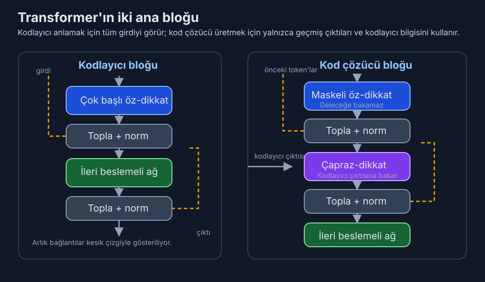

# Gün 4: Transformer Mimarisi — Kodlayıcı, Kod Çözücü ve Neden Her Şeyi Değiştirdi

*Dikkat mekanizmasını gördünüz — motoru. Bugün onun takıldığı arabayı görüyorsunuz: öyle zarif tasarlanmış bir makine ki, dokuz yıl sonra trilyon parametreli modeller hâlâ esasen aynı planı kullanıyor.*

---

## Olmayacak Gibi Görünen Bir Makale

2017 baharında Google'daki sekiz araştırmacının bir problemi vardı. Olağanüstü bir şey inşa etmişlerdi — yineleme yok, konvolüsyon yok, dikkat ve basit ileri beslemeli katmanlardan başka hiçbir şey olmayan bir diziden-diziye model — ve şok edici derecede iyi çalışıyordu. Ama "Attention Is All You Need"i değerlendirmeye gönderdiklerinde tepkiler karışıktı. Bazı hakemler artımsal buldu. Bazıları başlığı küstah gördü.

Makale kabul edildi. Sonra patladı.

2026 itibariyle Transformer mimarisi, bilgi işlem tarihindeki en sonuç doğuran mühendislik planı haline geldi. GPT-4'ü, Claude'u, Gemini'yi, Llama'yı, Mistral'ı, DeepSeek-V3'ü — her öncü dil modelini — güçlendiriyor. Bilgisayarlı görmeye (ViT), protein yapı tahminine (AlphaFold 2), müzik üretimine (Jukebox), hava tahminine (Pangu-Weather) ve robotiğe yayıldı. Orijinal makale 140.000'den fazla atıf topladı. Makine çevirisi için önerilen tek bir mimari tasarımı, yapay zekânın evrensel alt katmanı oldu.

Ama Transformer sadece dikkatten ibaret değil. Dikkat manşet oyuncusu, ama mimari özenle seçilmiş bileşenlerden oluşan bir topluluğun sayesinde başarılı — artık bağlantılar, katman normalizasyonu, konum-bazlı ileri beslemeli ağlar ve belirli bir kodlayıcı-kod çözücü düzenlemesi — her biri ayrı bir problemi çözüyor. Herhangi birini çıkarın ve tamamı çöker. Bugün her parçayı ve neden orada olduğunu anlayacağız.

## Büyük Resim: İki Kule

Orijinal Transformer, makine çevirisi için standart olan kodlayıcı-kod çözücü kalıbını takip eder. Bir kaynak cümleniz (diyelim İngilizce) ve üretmek istediğiniz bir hedef cümleniz (Fransızca) var. İki ayrı ağ bu iki işi üstlenir:

**Kodlayıcı** kaynak cümlenin tamamını okuyarak her token'ın zengin, bağlamsallaştırılmış bir temsilini oluşturur. Tüm konumları paralel olarak işler. 6 katmanlık öz-dikkat ve ileri beslemeli işlemden sonra, her token'ın temsili sadece o token'ın ne olduğunu değil, cümlenin tam bağlamındaki rolünü de kodlar.

**Kod Çözücü** hedef cümleyi her seferinde bir token üretir; hem kendi daha önce ürettiği token'lara hem de kodlayıcının çıktısına dikkat eder. Otoregresiftir: token 5, token 1-4'e bağlıdır, vb.

Bu ayrım önemli. Kodlayıcı tüm girdiyi aynı anda görebilir — anlama için mükemmel. Kod çözücü sıralı üretmek zorunda — tutarlı çıktı üretmek için gerekli. Bunlar temelden farklı hesaplama rejimleri ve Transformer her ikisini de aynı temel yapı taşıyla idare eder: **Transformer bloğu**.

*Ezberlenecek fark: kodlayıcıda öz-dikkat + FFN var; kod çözücüde bunlara ek olarak kodlayıcı çıktısına bakan çapraz-dikkat bulunur.*

## Bir Transformer Bloğunun İçi

Hem kodlayıcı hem de kod çözücü yığılmış bloklardan inşa edilir (orijinal makalede 6'şar). Her blok aynı temel kalıba sahiptir: dikkat, sonra ileri besleme, her alt katmanı artık bağlantılar ve normalizasyon sarar.

Bir token'ı tek bir kodlayıcı bloğundan takip edelim:

### Adım 1: Çok Başlı Öz-Dikkat

Token'ın temsili — temel modelde 512 sayılık bir vektör — öz-dikkat katmanına girer. Burada 8 paralel dikkat başı boyunca (her biri 64 boyutta çalışan) sorgulara, anahtarlara ve değerlere izdüşürülür, diğer tüm token'lara karşı dikkat ağırlıkları hesaplar ve dizinin geri kalanından gelen bilgiyle zenginleştirilmiş yeni bir temsil üretir.

Bunu Gün 3'ten zaten biliyorsunuz. Ama sonraki adım eşit derecede önemli.

### Adım 2: Topla ve Normalize Et (Artık Bağlantı)

Öz-dikkatin çıktısı orijinal girdiyi basitçe değiştirmez. Bunun yerine model, öz-dikkat çıktısını orijinal girdiye **ekler**:

**çıktı = KatmanNorm(x + ÖzDikkat(x))**

Bu, 152 katman derinliğinde ağ eğitmeye olanak tanıyan 2015 bilgisayarlı görme mimarisi ResNet'ten ödünç alınmış bir **artık bağlantıdır** (atlama bağlantısı da denir). Fikir güzel biçimde basit: girdiden çıktıya tam dönüşümü öğrenmek yerine, her alt katman sadece *farkı* — artığı — öğrenmek zorunda. Bir katmanda optimal davranış hiçbir şey yapmamaksa, ağ basitçe sıfır çıktı vermeyi öğrenebilir ve girdi değişmeden geçer.

Bu neden kritik? Artık bağlantılar olmadan derin Transformer'ları eğitmek neredeyse imkânsız. Geri yayılım sırasında gradyanlar her katmandan geriye doğru akmak zorundadır. Derin bir ağda bu, **kaybolan gradyan problemini** yaratır: gradyanlar her katmanda ağırlık matrisleriyle çarpılır ve bu çarpımlar sinyali tutarlı biçimde küçültürse, gradyanlar ilk katmanlara ulaştığında etkin olarak sıfırdır. Ağın ilk katmanları öğrenmeyi durdurur.

Artık bağlantılar bir **gradyan otoyolu** yaratır — tüm ara işlemeyi atlayarak çıktıdan girdiye doğrudan bir yol. Dikkat ve ileri beslemeli katmanlar gradyan-dostu olmayan davranış gösterse bile, atlama bağlantısı en azından *biraz* gradyanın doğrudan akmasını garanti eder. Bu yüzden eğitim süreci çökmeden 96 Transformer katmanı (GPT-3'teki gibi) ya da daha fazlasını yığabilirsiniz.

> 💡 **Artık bağlantılar neden bu kadar önemli?** Basit bir benzetme: 100 katlı bir binada asansör olmadan en üst kata çıkmak düşünün. Her katta merdiven çıkmak zorunda olduğunuzda, mesaj (gradyan) kaybolabilir. Artık bağlantı, doğrudan çatıya çıkan bir asansör gibidir — bilgi gecikmesiz akabilir.

### Adım 3: İleri Beslemeli Ağ

Öz-dikkat ve normalizasyondan sonra her token, **konum-bazlı ileri beslemeli ağdan** (FFN) geçer. Bu yanıltıcı biçimde basit: arada doğrusal olmayan bir aktivasyonla iki doğrusal dönüşüm.

**FFN(x) = W₂ · ReLU(W₁ · x + b₁) + b₂**

Temel Transformer'da girdi boyutu 512, iç boyut 2.048'e genişler (4× genişleme), sonra tekrar 512'ye düşürülür. Aynı ağırlıklar her token konumuna bağımsız olarak uygulanır — bu yüzden "konum-bazlı." Burada token'lar arası etkileşim yok. O, dikkatin işi.

Peki FFN aslında ne yapıyor?

Bu, Transformer'lar hakkındaki en hafife alınan kavrayışlardan biri: **dikkat ve ileri beslemeli katmanlar temelden farklı roller oynar.** Dikkat *iletişim* ile ilgilidir — token'ların bilgi paylaşmasını sağlar. FFN *hesaplama* ile ilgilidir — her token'ın komşularından bağlam topladıktan sonraki temsilini bireysel olarak işler.

Tel Aviv Üniversitesi'nden Mor Geva ve ark.'nın (2021) araştırması büyüleyici bir şey ortaya çıkardı: FFN katmanları **anahtar-değer bellekleri** olarak işlev görüyor. İlk doğrusal katman (W₁) bir kalıp eşleştirici gibi davranır — satırları belirli girdi kalıpları (belirli bir kavram, sözdizimsel yapı ya da anlamsal rol) için aktive olur. İkinci katman (W₂) ilişkili çıktıyı depolar — kalıp algılandığında enjekte edilecek bilgi. Başka bir deyişle, her FFN yaklaşık 2.048 kayıtlı, her biri öğrenilmiş bir gerçeği ya da dönüşüm kuralını kodlayan yumuşak bir arama tablosudur.

Bu, olgusal bilginin ileri beslemeli katmanlarda yaşadığı anlamına gelir. GPT-4 Paris'in Fransa'nın başkenti olduğunu "bildiğinde," bu bilgi dikkat katmanlarında değil FFN ağırlıklarındaki kalıplar olarak depolanmıştır. Dikkat neyin ilgili olduğunu bulur; FFN bilgiyi geri çağırır ve uygular.

### Adım 4: Bir Topla ve Normalize Et Daha

Adım 2 ile aynı — FFN çıktısı girdisine eklenir (artık bağlantı) ve katman normalize edilir. Ortaya çıkan vektör sonraki bloğun girdisi olur.

Bu kadar. İşte bir kodlayıcı bloğu: **öz-dikkat → topla & norm → FFN → topla & norm.** Bunlardan altı tanesini yığın ve tam kodlayıcınız olsun.

## Katman Normalizasyonu: Şarkısı Söylenmeyen Kahraman

Katman normalizasyonu her alt katmandan sonra görünür ve çoğu insan üstünden geçer. Bu bir hata — onsuz Transformer'lar eğitilemez.

KatmanNorm her token'ın temsilini boyutları boyunca sıfır ortalama ve birim varyansa normalize eder, sonra öğrenilmiş ölçek ve kayma parametreleri uygular:

**KatmanNorm(x) = γ · (x - μ) / σ + β**

μ ve σ tek bir token vektörünün 512 boyutu boyunca ortalama ve standart sapma, γ ve β boyut başına öğrenilmiş parametrelerdir.

Neden gerekli? Eğitim sırasında aktivasyonların istatistiksel dağılımı katmandan katmana ve gruptan gruba kaymaya meyillidir — **iç eşdeğişken kayması** denen olgu. Her katman sürekli hareketli bir hedefe uyum sağlamak zorundadır. KatmanNorm bu dağılımları stabilize eder, her katmanın girdisini düzgün davranışlı bir aralıkta tutarak öğrenme hızlarının normalde güvenli olandan çok daha yüksek olmasına izin verir.

Yıllarca tartışma yaratan bir incelik: orijinal Transformer, KatmanNorm'u artık toplamadan *sonra* uygular ("Post-LN"), yukarıda yazdığım gibi: **KatmanNorm(x + AltKatman(x))**. Ama 2020'de Xiong ve ark., alt katmandan *önce* uygulamanın ("Pre-LN"): **x + AltKatman(KatmanNorm(x))** — eğitimi özellikle derin modeller için önemli ölçüde daha kararlı hale getirdiğini gösterdi. GPT-3 ve torunları dahil çoğu modern Transformer Pre-LN kullanır. Keşfedilmesi üç yıl süren ama artık her yerde standart olan küçük değişikliklerden biri.

Fark göründüğünden daha önemli. Post-LN'de artık yol üzerinden gradyan normalizasyondan da geçer ve bu onu bozabilir. Pre-LN'de artık bağlantı tamamen engelsizdir — gradyanlar atlama bağlantısından sıfır müdahaleyle akar. 96 katmanlı bir model için bu fark, yakınsayan eğitim ile ıraksayan eğitim arasındaki uçurumdur.

## Kod Çözücü: Otoregresyon ve Maskeleme

Kod çözücü bloğu kodlayıcıdan biraz daha karmaşıktır, kritik bir eklemeyle: **çapraz-dikkat** katmanı.

Her kod çözücü bloğunun üç alt katmanı vardır:

1. **Maskeli öz-dikkat:** Kod çözücü kendi önceki çıktılarına dikkat eder, ama kritik bir kısıtlamayla — her konum sadece kendinden *önceki* konumlara (ve kendisine) dikkat edebilir. Bu, gelecek konumlar için dikkat puanlarını -∞'a ayarlayarak softmax sonrasında sıfır olmalarını sağlayan bir **nedensel maske** ile uygulanır — üçgensel bir matris. Bu maske olmadan kod çözücü eğitim sırasında gelecek token'lara bakarak "kopya çekebilir," sonraki-token tahmin görevini önemsiz derecede kolaylaştırıp modelin çıkarım zamanında metin üretme yeteneğini yok eder.

2. **Çapraz-dikkat:** Kod çözücünün kodlayıcıya baktığı yer. Kod çözücünün her konumdaki temsili sorgular üretir, ama anahtarlar ve değerler kodlayıcının çıktısından gelir. Kod çözücünün kaynak cümleye erişme yöntemi budur — Gün 3'teki Bahdanau dikkati, ama sorgu-anahtar-değer biçimciliğiyle uygulanmış.

3. **İleri beslemeli ağ:** Kodlayıcının FFN'si ile aynı.

Her alt katmanın kendi artık bağlantısı ve katman normalizasyonu vardır.

Nedensel maske mimarideki en zarif tasarım seçimlerinden biri. Eğitim sırasında model hedef cümlenin tamamını paralel olarak işler — tüm konumlar aynı anda. Ama maske, konum *t*'nin sadece 1'den *t*'ye kadar olan konumları görmesini sağlayarak sıralı üretim sürecini simüle eder. Buna **öğretmen zorlama** denir: model kendi tahminleri yerine doğru önceki token'ları (eğitim verisinden) görür. Her sorunun bir öncekinin cevabını açığa çıkardığı — ama sadece bir öncekinin — bir sınav gibi.

Bu paralellik, Transformer eğitiminin bu kadar hızlı olmasının nedenidir. Yinelemeli bir kod çözücü eğitim sırasında bile her token'ı sıralı işlemek zorunda kalırdı. Maskeli Transformer kod çözücü tüm token'ları aynı anda işleyerek otoregresif özelliği maskeyle korur. 512 token'lık bir dizide bu 512× hızlanma demek.

## Parametreler Nerede Yaşar

Temel Transformer için hesabı yapalım (d_model = 512, d_ff = 2048, 8 baş, yığın başına 6 katman).

**Bir kodlayıcı bloğu** için:
- Öz-dikkat: 4 izdüşüm matrisi (Q, K, V ve çıktı), her biri 512×512 = 262.144 parametre × 4 = **~1,05M**
- FFN: W₁ 512×2048, W₂ 2048×512, artı bias'lar = **~2,1M**
- KatmanNorm: 2 × 512 × 2 (iki alt katmanın her biri için ölçek ve kayma) = **~2K**
- Blok başına toplam: **~3,15M**

Altı kodlayıcı bloğu: **~19M**

**Bir kod çözücü bloğu** için çapraz-dikkat ekleyin (~1,05M) = blok başına **~4,2M**, altısı için **~25M**.

Artı gömmeler (~37.000 sözlük × 512) ve son çıktı izdüşümü: **~19M**.

Genel toplam: kabaca **65 milyon parametre**. Modern standartlara göre minnacık — GPT-4'ün uzmanlar karışımı yapısında 1,7 trilyondan fazla parametresi olduğu söyleniyor. Ama orijinal Transformer'ın 65M parametresi makine çevirisinde en ileri sonuçları elde etmeye yetmişti. Her parametre çok çalışıyordu.

Parametrelerin büyük kısmının nerede yaşadığına dikkat edin: ileri beslemeli katmanlarda. FFN her bloğun parametrelerinin yaklaşık üçte ikisini oluşturur (dikkat için 1,05M'e karşı 2,1M). Bu oran ölçekleme çağı boyunca şaşırtıcı biçimde sabit kalmıştır. GPT-3'ün 175 milyar parametresinde FFN katmanları hâlâ ağırlıkların kabaca üçte ikisini tutar. Bu, FFN katmanlarının modelin "bilgi deposu" olduğu görüşüyle tutarlıdır — dünyanın bilgisini ezberlemek için çok kapasiteye ihtiyacınız var.

## Yalnızca-Kod Çözücü Devrimi

İşte yapay zekâ tarihinin bir ironisi: Transformer'ın en başarılı uygulaması kodlayıcıyı hiç kullanmıyor.

GPT-1 (2018) radikal bir sadeleştirme yaptı. OpenAI'dan Alec Radford ve meslektaşları sadece kod çözücü yığınını alıp kodlayıcıyı ve çapraz-dikkati attılar ve onu saf bir dil modeli olarak eğittiler: önceki tüm token'lar verildiğinde sonraki token'ı tahmin et. Çeviri çiftlerine gerek yok. Kaynak ve hedef dillere gerek yok. Sadece internetten ham metin.

Bu yalnızca-kod çözücü mimarisi GPT-2, GPT-3, GPT-4, Claude, Llama, Mistral ve çoğu modern dil modelini güçlendirir. Kodlayıcı-kod çözücü mimarisi T5, BART ve Google'ın çeviri sisteminin orijinal versiyonunda varlığını sürdürüyor, ama amiral gemisi üretken yapay zekâ modelleri için yalnızca-kod çözücü kazandı.

Neden? Üç sebep:

**Basitlik.** İki yerine tek yığın. Daha az tasarım kararı. Daha az ayarlanacak hiperparametre.

**Birleşik ön eğitim hedefi.** Nedensel dil modelleme (sonraki token'ı tahmin et) metin için en doğal öz-denetimli hedeftir. Paralel korpusa ya da özenle tasarlanmış görevlere ihtiyacınız yok — sadece metin atın.

**Ölçekleme özellikleri.** Yalnızca-kod çözücü modeller ampirik olarak daha düzgün ölçekleniyor. DeepMind 2022'de Chinchilla ölçekleme yasalarını yayınladığında, deneyler tamamen yalnızca-kod çözücü modeller üzerindeydi. Ölçekleme eğrileri dikkat çekici derecede temiz: parametreleri ikiye katla, kaybı yarıya indir, olağanüstü öngörülebilirlikle.

BERT'in yaklaşımı da var — **yalnızca-kodlayıcı** — maskeli dil modelleme kullanır: token'ların %15'ini rastgele gizle ve çevreleyen bağlamdan tahmin et. BERT (340M parametre, 2018) anlama görevleri (sınıflandırma, soru yanıtlama, adlandırılmış varlık tanıma) için muazzam etkili oldu ama üretim için kullanılmaz. Cümlenin tamamını gören bir modeli sonraki kelimeyi yazmak için kullanamazsınız — cevaba zaten göz atıyor.

Yani üç Transformer paradigması şöyle:

| Mimari | Gördüğü | Kullanım Alanı | Örnekler |
|---|---|---|---|
| Yalnızca-kodlayıcı | Tam girdi (çift yönlü) | Anlama, sınıflandırma | BERT, RoBERTa |
| Yalnızca-kod çözücü | Sadece geçmiş token'lar (nedensel) | Üretim, genel amaçlı | GPT, Claude, Llama |
| Kodlayıcı-kod çözücü | Kodlayıcı: tam girdi; Kod çözücü: geçmiş çıktı | Çeviri, özetleme | T5, BART, mBART |

Yalnızca-kod çözücü modeller bugün hakim, çünkü üretim daha zor ve daha genel bir problem olarak ortaya çıktı. Tutarlı metin üretebilen bir model aynı zamanda soruları yanıtlayabilir, duygu sınıflandırabilir, diller arası çeviri yapabilir ve kod yazabilir — hepsi "bu girdi verildiğinde, doğru çıktıyı üret" olarak çerçevelenir. Kodlayıcı-kod çözücü ayrımı çeviri için bir optimizasyondu ve genel durum için gereksiz olduğu ortaya çıktı.

## Şaşırtıcı Basitlik

İşte sizi gerçekten şaşırtması gereken gerçek: **Transformer göreve özgü hiçbir bileşen içermez.**

Mimari tanımını tekrar okuyun. Öz-dikkat: genel çiftli benzerlik hesaplaması. İleri beslemeli ağ: basit iki katmanlı MLP. Artık bağlantılar: görüntü sınıflandırmadan ödünç. Katman normalizasyonu: genel istatistiksel düzenleyici. Konumsal kodlamalar: sinüzoidal fonksiyonlar.

Transformer'da "bu dil içindir" diyen *hiçbir şey* yok. Dilbilgisi kuralı yok. Ayrıştırma ağacı yok. Sözcük türü etiketi yok. Morfolojik analiz yok. Hiçbir türde dilbilimsel bilgi yok. Genel amaçlı bir dizi işleme makinesi — ve yine de ham metinden sözdizimi, anlambilim, edimbilim, muhakeme ve sağduyuyu öğrendi.

Bu yüzden mimari görmeye (ViT görüntü yamalarını dizi olarak işler), sese (Whisper spektrogramları dizi olarak ele alır), protein yapısına (AlphaFold 2 amino asit zincirlerini dizi olarak ele alır) ve hatta havaya (Pangu-Weather atmosferik ızgara noktalarını dizi olarak ele alır) bu kadar zahmetsiz geçti. Transformer ne işlediğini bilmez. Sadece bir dizinin öğelerinin birbiriyle konuşmasını ve giderek daha rafine temsiller oluşturmasını bilir.

Efsanevi oyun programcısı John Carmack bunu güzel ifade etti: Transformer "utanç verici derecede basit." Sihir bileşenlerde değil — bileşenlerin *kombinasyonunda* ve uygulandıkları *ölçekte*.

## İşe Yaratan Eğitim Hileleri

Orijinal makale, gözden kaçırması kolay ama hayati olan çeşitli eğitim ayrıntıları içeriyordu:

**Isınma öğrenme hızı takvimi.** Sabit bir öğrenme hızıyla başlamak yerine, Transformer ilk 4.000 adım boyunca öğrenme hızını doğrusal olarak artıran, sonra adım sayısının ters karekökü ile orantılı azaltan bir takvim kullanır. Bu ısınma, kayıp peyzajının iyi anlaşılmadığı erken eğitimde modelin aşırı büyük güncellemeler yapmasını engeller. Neredeyse her modern Transformer bir tür ısınma kullanır.

**Bırakma (Dropout).** Model, dikkat ağırlıklarına ve her alt katmandan sonra dropout (temel modelde 0,1 oranında) uygular. Bu, eğitim sırasında değerlerin %10'unu rastgele sıfırlayarak aşırı uyumu engeller ve modeli yedekli temsiller geliştirmeye zorlar.

**Etiket yumuşatma.** Modeli doğru sonraki token için 1,0, diğer her şey için 0,0 olasılık tahmin edecek şekilde eğitmek yerine, makale ε = 0,1 ile etiket yumuşatma kullanır — az miktarda olasılık kütlesini tüm token'lara eşit dağıtır. Bu aslında şaşkınlığa zarar verir (model tahminlerinde daha az "emin" hale gelir) ama BLEU puanlarını ve genellemeyi iyileştirir. Model aşırı özgüvenli olmak yerine uygun biçimde belirsiz olmayı öğrenir.

**Özel β₂'li Adam optimize edici.** Makale β₁ = 0,9, β₂ = 0,98 ve ε = 10⁻⁹ ile Adam kullanır. Alışılmadık derecede yüksek β₂ (standart 0,999), optimize edicinin öğrenme hızını son gradyan büyüklüklerine göre daha hızlı uyarladığı anlamına gelir ve bu Transformer'ın eğitim dinamiklerine uygundur.

Bunlar gösterişli ayrıntılar değil. Ama eğitilen bir Transformer ile eğitilemeyenin farkı çoğunlukla tam olarak bu seçimlere gelir. Mimari gerekli ama yeterli değil — eğitim reçetesine de ihtiyacınız var.

## Bağlamda Rakamlar

Uzaklaşıp orijinal Transformer'ın ne başardığını takdir edelim:

| Metrik | Temel Transformer | Önceki En İyi | İyileştirme |
|---|---|---|---|
| EN-DE BLEU | 27,3 | 26,36 | +0,94 |
| EN-FR BLEU | 38,1 | 41,0 (topluluk) | Tekli model eşleşti |
| EN-DE (büyük) | 28,4 | 26,36 | +2,04 |
| EN-FR (büyük) | 41,8 | 41,0 | +0,8 |
| Eğitim maliyeti (temel) | 12 saat, 8 P100 | Haftalarca eğitim | ~10-50× ucuz |

Büyük model, topluluk sistemlerini — birden fazla bağımsız eğitilmiş modelin kombinasyonlarını — tek bir modelle aştı. Ve bunu 3,5 günlük eğitimle yaptı. Önceki en ileri İngilizce-Fransızca sistem haftalarca eğitilmişti.

2017 bulut fiyatlarıyla eğitim maliyeti: temel model için kabaca 150 dolar, büyük model için belki 800 dolar. Bugün GPT-4'ün eğitim maliyeti 50-100 milyon dolar olarak tahmin ediliyor. Mimari aynı. Değişen tek şey ölçek (parametreler, veri, hesaplama) ve bazı artımsal iyileştirmeler. Transformer hakkındaki en dikkat çekici gerçek bu: doğuşunda *zaten doğru mimari*ydi. Dokuz yıllık ilerleme onu yeniden icat etmek değil, büyütmek oldu.

## Bu Mimarinin Dayanıklılığı

Transformer'ın uzun ömürlülüğü makine öğrenmesinde neredeyse emsalsiz. Önceki baskın mimariler — algılayıcılar, vanilya RNN'ler, LSTM'ler, CNN'ler — her biri yerini almadan önce 3-5 yıl hüküm sürdü. Transformer tacı 2017'den beri tutuyor ve 2026'da ufukta ciddi bir rakip yok.

Neden? Çünkü nadir bir denge noktasına isabet ediyor:

1. **Matematiksel zarafet.** Çekirdek işlemler (matris çarpımları, softmax) basit ve iyi anlaşılmış.
2. **Donanım uyumu.** Yoğun matris işlemleri için optimize edilmiş GPU/TPU mimarilerine mükemmel oturur.
3. **Ölçekleme öngörülebilirliği.** Parametre ve veri ekledikçe kayıp düzgün ve öngörülebilir biçimde azalır.
4. **Modüler genişletilebilirlik.** Bileşenleri (farklı dikkat kalıpları, farklı FFN mimarileri, farklı normalizasyon) tüm sistemi yeniden tasarlamadan değiştirebilirsiniz.
5. **Ampirik sağlamlık.** Temel değişiklik olmadan alan genelinde çalışır — dil, görme, ses, bilim.

Baştan doğru olan nadir tasarımlardan biri. ML tarihindeki çoğu mimari yıllarca yinelemeli rafine gerektirdi. Transformer ölçek gerektirdi.

---

*Yarın, bir yapay zekâ sistemi kullandığınız her seferde karşılaştığınız ama muhtemelen hiç düşünmediğiniz bir şeye dalacağız: **tokenizasyon**. GPT-4 neden "tokenization"ı bir token olarak görüyor ama "token" da bir token? Kelimelerdeki harfleri saymakta neden zorlanıyor? İngilizce dışı dilleri işlemek neden daha pahalı? Cevaplar Byte Pair Encoding adlı büyüleyici bir algoritma ve metni bir Transformer'a beslemeden önce nasıl parçalara böldüğünüzün şaşırtıcı derecede derin sonuçlarını içerir.*

---

## Anlayışınızı Test Edin

Öğrendiklerinizi kontrol etmeye hazır mısınız? Gün 4 quizini çözün:

<link rel="stylesheet" href="../quiz/style.css">

