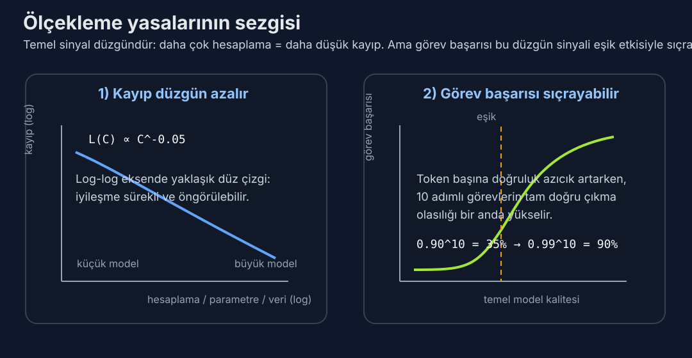

# Gün 7: Ölçekleme Yasaları — Neden Büyük Modeller Daha Akıllıdır

*Bir hafta boyunca mekanizmayı öğrendiniz: tokenizer'lar, dikkat, Transformer'lar, ön eğitim hedefleri. Şimdi modern yapay zekânın en derin ampirik keşfiyle yüzleşiyoruz — dil modellerinin performansının onları büyüttükçe kesin, öngörülebilir matematiksel yasaları takip ettiği. Belirsiz eğilimler değil. Bilinen üslere sahip gerçek kuvvet yasaları. Bu tek kavrayış yüz milyarlarca dolarlık yatırım kararını şekillendirdi, süper bilgisayar ölçeğinde GPU kümelerinin inşasını yönlendirdi ve sorunun büyük modellerin daha iyi çalışıp çalışmadığı değil, dolar başına en fazla zekâyı elde etmek için hesaplama, veri ve parametreleri tam olarak nasıl ayırmanız gerektiği olduğu bir yarışı tetikledi.*

---

## Her Şeyi Değiştiren Keşif

Ocak 2020'de Johns Hopkins ve OpenAI'daki bir araştırmacı ekibi — Jared Kaplan, Sam McCandlish, Tom Henighan, Tom Brown, Benjamin Chess, Rewon Child ve diğerleri — tüm alanı yeniden şekillendirecek "Scaling Laws for Neural Language Models" makalesini yayınladı. Bulguları basitliğiyle çarpıcıydı: bir dil modelinin çapraz entropi kaybını parametre sayısına, eğitim verisi miktarına ya da kullanılan hesaplama miktarına karşı çizdiğinizde, log-log grafiğinde olağanüstü temiz düz çizgiler elde edersiniz.

Log-log grafiğinde düz çizgiler **kuvvet yasaları** demektir. L kaybı şöyle denklemleri takip eder:

**L(N) ∝ N^(−0,076)** parametreler için  
**L(D) ∝ D^(−0,095)** veri kümesi boyutu için  
**L(C) ∝ C^(−0,050)** hesaplama bütçesi için  

Bu üsler küçüktür, yani fark edilir iyileştirmeler için büyüklük sırası artışlara ihtiyacınız var. Ama çizgiler dikkat çekici derecede düzgün — **yedi büyüklük sırası** hesaplama boyunca uzanıyor. Uçurum yok, plato yok, sihirli eşik yok. Sadece sabit, öngörülebilir bir aşağı yürüyüş.

Bunun ne kadar alışılmadık olduğunu düşünün. Çoğu mühendislik disiplininde azalan getirilere hızla ulaşırsınız. İki kat büyük bir motor iki kat hızlı gitmez. İki kat yüksek bir bina iki kat fazla insanı barındırmaz. Ama dil modelleri mi? Hesaplamayı ikiye katla ve kayıpta mükemmel öngörülebilir bir düşüş elde et. Her seferinde.

*Soldaki grafik araştırmacıların “ölçekleme yasası” dediği düzgün temel sinyali gösterir. Sağdaki grafik ise neden aynı düzgün sinyalin pratik görevlerde aniden beliren yetenekler gibi hissedildiğini açıklar.*

## "Kayıp" Pratikte Gerçekten Ne Anlama Gelir

Daha ileri gitmeden, neyin iyileştiğini netleştirelim. Çapraz entropi kaybı modelin sonraki token'ı ne kadar iyi tahmin ettiğini ölçer. 3,0'lık kayıp, modelin kabaca 20 eşit olasılıklı token arasından seçiyormuş kadar belirsiz olduğu anlamına gelir (e^3 ≈ 20). 2,0'lık kayıp bunu yaklaşık 7 seçeneğe daraltır. 1,5'lik kayıp kabaca 4,5 seçenek demek.

Bunlar küçük sayısal değişimler gibi görünüyor ama niteliksel olarak farklı davranışlara karşılık geliyor. 3,0 kayıpta bir model bozuk, zar zor tutarlı metin üretir. 2,5'te dilbilgisi doğru ama olgusal olarak güvenilmez. 2,0'da "bilgi" diyeceğimiz şeyi sergilemeye başlar — olgusal ifadeleri tamamlayabilir, talimatları takip edebilir ve idare eder düzyazı yazabilir. 1,5'te hukuki dava dilekçeleri yazabilen, kod hatası ayıklayabilen ve kuantum mekaniğini açıklayabilen modellerin alanındasınız.

Kaplan ölçekleme yasaları bu yetenek eşiklerinin rastgele olmadığını gösterdi — eğitim başlamadan bile tahmin edebileceğiniz düzgün bir eğri üzerindeki kilometretaşlarıdır. Hesaplama bütçenizi biliyorsanız, nihai kaybı tahmin edebilirsiniz. Ve kayıptan, modelin neyi yapıp neyi yapamayacağını kabaca öngörebilirsiniz.

## Kaplan Reçetesi: Veriye Karşı Parametreler

Orijinal Kaplan ve ark. makalesi, yıllarca OpenAI'ın stratejisine rehberlik edecek spesifik bir pratik sonuç çıkardı: **sabit bir hesaplama bütçeniz olduğunda, modeli daha fazla veri üzerinde eğitmek yerine daha büyük yapmaya öncelik vermelisiniz**.

Analizleri, hesaplamayı 10 kat artırdığınızda parametreleri kabaca 5,5 kat ama veriyi sadece 1,8 kat artırmanız gerektiğini önerdi. Optimal model yetersiz eğitilmiştir — tamamen yakınsamak için yeterli veri görmemiştir — ama büyüktür. Bu, "modeli mümkün olduğunca büyük yap ve yakınsamaya ulaşmak konusunda çok endişelenme" felsefesine yol açtı.

OpenAI'ın GPT-3 ile yaptığı tam olarak buydu. Haziran 2020'de — Kaplan'ın makalesinden sadece aylar sonra — yayınlanan GPT-3, **175 milyar parametre** ile yaklaşık **300 milyar token** üzerinde eğitildi. Modern standartlara göre ciddi biçimde yetersiz eğitilmiş bir model (parametre başına 2'den az token oranı). Ama zamanı için devasa ve olağanüstü çalıştı. GPT-3, hiç kimsenin daha önce görmediği düzeyde az-örnekli öğrenme, kod üretimi ve yaratıcı yazım sergiledi.

Kaplan reçetesi doğrulanmış gibiydi. Parametreleri ölçekle. Hızlı ölçekle. Geriye bakma.

## Chinchilla: Sürpriz Dönüş

İki yıl sonra DeepMind'daki bir ekip bomba düşürdü. Jordan Hoffmann, Sebastian Borgeaud, Arthur Mensch ve meslektaşları Mart 2022'de evrensel olarak **Chinchilla** diye bilinen "Training Compute-Optimal Language Models" makalesini yayınladı.

400'den fazla eğitim deneyi yürüterek model boyutlarını sistematik olarak 70 milyondan 16 milyar parametreye, veri kümesi boyutlarını da 5 milyardan 500 milyar token'a kadar değiştirdiler. Sonuçları Kaplan'la doğrudan çelişiyordu: **parametreler ve veri eşit biçimde ölçeklenmelidir**. Hesaplamayı 10 kat artırırsanız, hem parametreleri hem de eğitim verinizi 3,16 kat artırmalısınız (3,16 × 3,16 ≈ 10 olduğundan).

Chinchilla-optimal oran yaklaşık **parametre başına 20 token** çıkıyor. 70 milyar parametreli bir model yaklaşık 1,4 trilyon token görmeli. 7 milyar parametreli bir model yaklaşık 140 milyar.

Noktalarını kanıtlamak için Chinchilla'yı eğittiler: 1,4 trilyon token üzerinde 70 milyar parametreli bir model. 280 milyar parametreli Gopher'dan (DeepMind'ın önceki amiral gemisi) 4 kat küçük olmasına rağmen, Chinchilla hemen hemen her ölçütte Gopher'la eşleşti ya da geçti. Aynı hesaplama bütçesi, radikal biçimde farklı dağılım — ve daha küçük, daha iyi eğitilmiş model kazandı.

Bu bir uyandırma çağrısıydı. GPT-3'ün Chinchilla terimleriyle **verisi için kabaca 5-7 kat çok büyük** olduğu anlamına geliyordu. Daha fazla token üzerinde eğitilmiş ~30 milyar parametreli bir model olmalıydı. Sektör genelinde milyarlarca dolarlık hesaplama optimal altı biçimde ayrılmıştı.

## Kaplan Neden Yanlış Çıktı?

Kaplan ve Chinchilla arasındaki uyuşmazlık ölçekleme yasalarının temel varlığıyla ilgili değil — ikisi de performansın kuvvet yasalarını takip ettiği konusunda hemfikir. Farklılık metodolojiye dayanıyor.

Kaplan ve ark. optimal dağılımı her modeli eğitim süresine göre ayarlamayan **sabit bir öğrenme hızı takvimi** ile eğiterek tahmin etti. Daha küçük modelleri orantılı olarak daha fazla adım için eğitildi, ama öğrenme hızı soğutmasını ayarlamadan bu modeller tam yakınsamamıştı. Bu, veriyi olduğundan daha az değerli gösterdi — modeller daha fazla veri üzerinde "eğitilmişti" ama öğrenme hızı hâlâ çok yüksek olduğu için verimli öğrenmiyordu.

Chinchilla her çalışma süresi için düzgün ayarlanmış bir kosinüs öğrenme hızı takvimi kullandı. Bu düzeltmeyle veri çok daha değerli hale geldi ve optimal denge dramatik biçimde daha fazla veri ve daha az parametreye doğru kaydı.

Görünüşte küçük bir deneysel tasarım seçiminin — öğrenme hızı zamanlamasının — tüm bir sektörün sermaye dağılımını yeniden şekillendiren sonuçlara nasıl yol açabileceğine dair uyarıcı bir hikâye. Tarihin en pahalı hiperparametre hatası olduğu savunulabilir.

## Chinchilla Vergisi ve Çıkarım Devrimi

Ama sektörün Chinchilla-optimal eğitimi hemen benimsememesinin daha derin bir nedeni var ve bu, dağıtım ekonomisiyle ilgili.

Bir modeli eğitmek bir kerelik maliyet. Çıkarım — modeli kullanıcı sorgularına hizmet vermek için gerçekten çalıştırmak — her API çağrısıyla büyüyen süregelen bir gider. Ve çıkarım maliyetine eğitim verisi değil **parametre sayısı** hâkimdir. 70 milyar parametreli bir model, ne kadar iyi eğitilmiş olursa olsun, sorgu başına 7 milyar parametreli modelden kabaca 10 kat daha pahalıdır.

Bu, uygulayıcıların **Chinchilla vergisi** dediği ya da daha doğrusu "çıkarım için fazla eğit" stratejisini yaratır. Milyarlarca sorguya hizmet verecekseniz, toplam olarak Chinchilla'nın önerdiğinden çok daha uzun süre daha küçük bir model eğitmek — biraz daha yüksek kaybı kabul edip dramatik biçimde daha ucuz çıkarım karşılığında — daha ucuz olabilir.

Meta'nın **LLaMA** (Şubat 2023) ile yaptığı tam olarak bu. LLaMA-7B **1 trilyon token** üzerinde eğitildi — Chinchilla-optimal miktarın yaklaşık 7 katı. LLaMA-13B aynı 1T token'ı gördü, parametre başına ~77 token oranı vererek, Chinchilla önerisinin neredeyse 4 katı. Sonuç? LLaMA-13B, 13 kat daha küçük olmasına rağmen çoğu ölçütte GPT-3 (175B) ile eşleşti.

Meta pratik bir boşluk bulmuştu: ekstra eğitim hesaplamasını (bir kerelik maliyet) dağıtması kalıcı olarak daha ucuz bir modelle takas edebilirsiniz. Aynı kavrayış Mistral-7B, Phi-2 ve 2023-2024'e hâkim olan "devasa veri üzerinde eğitilmiş küçük modeller" sınıfının tamamını yönlendirdi.

## Chinchilla'nın Ötesi: 2025-2026'da Sınır

Orijinal ölçekleme yasaları hesaplama-optimal eğitim dünyasını tarif ediyordu. Ama sınır bu basit resmin çok ötesine taşındı.

**DeepSeek'in ölçekleme çalışması**, Uzmanlar Karışımı gibi mimari seçimleri hesaba kattığınızda yasaların aşırı ölçekte beklenenden bile daha temiz geçerli olduğunu gösterdi. DeepSeek-V2 (2024), MoE modellerinin *aktif* parametreleri ve toplam parametreleri bağımsız olarak ölçeklediğiniz kendi ölçekleme eğrilerini takip ettiğini gösterdi — ve MoE daha verimli ölçekleniyor çünkü token başına parametrelerin sadece bir kısmı kullanılır.

**Llama 3** (Nisan 2024) fazla eğitim rejimini daha da ileri taşıdı. 8B model **15 trilyon token** üzerinde eğitildi — parametre başına neredeyse 2.000 token, Chinchilla oranının kabaca 100 katı. Meta, eğitimi durdurduklarında kaybın *hâlâ azalmakta olduğunu* bildirdi; bu da 15T token'ın bile 8B modelin öğrenebileceğini doyurmamış olduğunu düşündürüyor. Küçük modellerin daha fazla verinin aşamayacağı sabit bir "kapasitesi" olduğu nosyonunu yıktı.

**Epoch AI'ın analizi** (2025), öncü laboratuvarların farklı türde bir duvara çarptığını tahmin etti: ölçekleme yasası platosu değil, **veri duvarı**. İnternetteki yüksek kaliteli metnin toplam miktarı kabaca 10-15 trilyon token. GPT-4 ve Claude 3 gibi modeller, kamuya açık tüm metnin önemli bir bölümünde eğitildi. Veri yoksa veriyi 10 kat ölçekleyemezsiniz.

Bu çoklu tepkilere yol açtı: sentetik veri üretimi (diğer modeller için eğitim verisi yaratmak üzere modeller kullanma), çok dönemli eğitim (aynı veriyi birden fazla kez görme, işe yarıyor ama azalan getiriyle — tipik olarak 4 dönem sonra ~0,1 nat kayıp) ve çok modlu eğitim (veri diyetine görüntü, video, ses ve kod ekleme).

## Ortaya Çıkışın Şaşırtıcı Matematiği

Ölçekleme yasalarının belki de en sezgiye aykırı çıkarımı şu: **düzgün kayıp eğrileri süreksiz yetenekler üretir**.

Kayıp kademeli olarak azalır — belirli bir ölçekte ani sıçrama yok. Ama belirli yetenekler belirli ölçeklerde "ortaya çıkıyor" gibi görünür. 10B parametreli bir model çok adımlı aritmetik yapamaz. 100B'de birdenbire yapabilir. 50B'lik bir model karmaşık talimatları güvenilir biçimde takip edemez. 200B'de tutarlı biçimde yapar.

Bu nasıl çalışır? Cevap, kaybın görev performansıyla nasıl bağlandığında yatıyor. 10 ardışık token tahminini doğru yapmayı gerektiren bir görev hayal edin. Her token'ın doğru olma olasılığı %90 ise, 10'unun hepsini doğru yapma olasılığı 0,9^10 ≈ %35. Token başına %95'te, 0,95^10 ≈ %60. %99'da, 0,99^10 ≈ %90.

Token başına doğruluktaki o düzgün iyileşme (%90 → %95 → %99) sadece 0,15 nat'lık kayıp azalmasına karşılık gelir. Ama görev başarı oranı %35'ten %90'a sıçrar. Ölçekleme yasası düzgün; ölçüt değil. Ortaya çıkış büyü değil — token başına doğruluk ile çok adımlı görev tamamlama arasındaki doğrusal olmayan ilişki tarafından yönlendirilen bir **faz geçişidir**.

Stanford ve başka yerlerdeki araştırmacılar tarafından resmileştirilen bu kavrayış, alandaki en büyük tartışmalardan birini çözdü. Ortaya çıkış, yeteneklerin ölçekte gerçekten belirdiği anlamında gerçektir. Ama gizemli değildir — göreve özgü eşiklere ulaşan düzgün temel iyileşmenin öngörülebilir bir sonucudur.

## 100 Milyon Dolar Size Ne Alır (ve Neden Önemlidir)

Ölçekleme yasaları yapay zekâyı bir sermaye dağılımı egzersizine dönüştürür. 2026 başı itibariyle kabaca hesap:

- **1T token üzerinde 8B model eğitimi:** ~2-3 milyon dolar (H100 kümelerinde)
- **2T token üzerinde 70B model eğitimi:** ~20-30 milyon dolar
- **10T+ token üzerinde 400B+ öncü model eğitimi:** ~100-300 milyon dolar
- **GPT-4 eğitim maliyeti (tahmini):** ~100 milyon dolar (2023 dolarıyla)
- **Llama 3 405B:** Meta aylarca ~30.000 H100 GPU kullandı, tahmini 50-100M+ dolar

Ölçekleme yasaları o paraya tam olarak ne aldığınızı söyler. Hesaplama bütçenizi ikiye katlamak kaybı yaklaşık %3,4 azaltır (C^(−0,050) üssünü kullanarak). Pek çok şey gibi görünmüyor, ama o %3,4 güvenilir biçimde çalışan kod yazabilen ve yazamayan model arasındaki fark, ya da zamanın %30'u yerine %20'si halüsinasyon gören model arasındaki fark olabilir.

GPU silahlanma yarışının bu kadar yoğun olmasının nedeni bu. NVIDIA'nın H100'leri tanesi 25.000-40.000 dolar. Öncü bir eğitim kümesi 10.000-50.000 taneye ihtiyaç duyar. Ağ donanımı, güç, soğutma ve mühendislik personeli dahil toplam maliyet, tek bir eğitim sürecinin dokuz haneli bir bahis olduğu anlamına gelir. Ve ölçekleme yasaları laboratuvarlara bu bahsi yapmak için yeterli güveni verir — çünkü getiriler öngörülebilir.

## Ölçeklemenin Sınırları

Ölçekleme yasaları ebedi mi? Neredeyse kesinlikle hayır.

Birkaç potansiyel tavan beliriyor:

1. **Veri tükenmesi**: Bahsedildiği gibi, yüksek kaliteli eğitim metninden tükeniyoruz. Sentetik veri yardımcı oluyor ama dağılımsal önyargılar getiriyor.

2. **Donanım limitleri**: NVIDIA'nın B200 ve GB300 çipleriyle bile, sonunda güç şebekesi kısıtlamalarına çarparsınız. 100.000 GPU'luk bir küme 50-150 megawatt çeker — küçük bir şehri aydınlatmaya yeter.

3. **Azalan ekonomik getiri**: Kaybı yarıya indirmek 100 kat hesaplama gerektirebilir. Bir noktada harcanan dolar başına marjinal iyileştirme ticari uygulamalar için değmez.

4. **İndirgenemez entropi**: Dilin kendisinin bir öngörülemezlik tabanı var. Shannon İngilizce metnin karakter başına yaklaşık 1,0-1,5 bit entropiye sahip olduğunu tahmin etti. Hiçbir model dildeki doğal rastgelelikten daha iyi tahmin yapamaz. Mevcut öncü modeller temiz metin üzerinde bu teorik tabana yaklaşıyor.

5. **Ölçüt doygunluğu**: Birçok standart ölçütte (MMLU, HellaSwag, ARC) öncü modeller zaten %90+ puan alıyor. Kalan hatalar genellikle model başarısızlıkları değil belirsiz sorular.

Ama işin aslı şu: birisi ölçeklemenin sonunu her tahmin ettiğinde yanılmıştır. Alan yeni ölçekleme boyutları bulmaya devam ediyor — daha fazla veri türü, daha iyi veri kalitesi, ölçekleme eğrilerini kaydıran mimari iyileştirmeler ve şimdi de **test zamanı hesaplama ölçeklemesi** (eğitim yerine çıkarım sırasında daha fazla hesaplama harcama).

## Felsefi Ağırlık

Ölçekleme yasaları neredeyse tedirgin edici bir çıkarıma sahip: zekâ, ya da en azından dil ölçütleriyle ölçtüğümüz türde zekâ, bir **emtia** olabilir. Çığır açıcı algoritmik kavrayış gerektiren mistik bir özellik değil, yeterli GPU ve veriyle satın alabileceğiniz bir şey.

Bu felsefi açıdan ağır. Zar zor dilbilgisel cümleler kurabilen bir modelle baro sınavını geçebilen bir model arasındaki farkın "sadece" birkaç büyüklük sırası hesaplama olduğunu düşündürüyor. Farklı bir mimari değil. Farklı bir eğitim prosedürü değil. Sadece... daha fazla.

Bunun gerçek anlama, muhakeme ya da bilince genellenip genellenemeyeceği tamamen farklı bir soru — bu kursta ileride boğuşacağımız bir soru. Ama ampirik gerçek duruyor: düzgün ölçekleme niteliksel olarak farklı yetenekler üretiyor. Ve bu, ölçekleme yasalarını modern yapay zekânın en önemli ampirik bulgusu yapmaya yetiyor.

---

## Yarın Ne Geliyor

Artık büyük modellerin daha akıllı olduğunu ve dolar başına maksimum zekâ için hesaplamayı kabaca nasıl dağıtmanız gerektiğini biliyorsunuz. Ama ölçeklemeden soyut olarak bahsediyorduk — parametreler, token'lar, FLOP'lar. Yarın **gerçek eğitim altyapısının** perdesi açılıyor: GPU'lar, kümeler, ağ donanımı, veri hatları ve binlerce hızlandırıcıyı uyum içinde çalıştırmak için gereken şaşırtıcı mühendislik. 100 milyon dolarlık eğitim altyapısı gerçekte neye benzer? 50.000 GPU'yu nasıl senkronize edersiniz? Ve eğitimin ortasında biri arızalanırsa ne olur? 2. Haftaya hoş geldiniz.

---

### 📝 Anlayışınızı Test Edin

Öğrendiklerinizi kontrol etmeye hazır mısınız? İnteraktif quizi çözün:

<a href="quizzes/day-07.html" style="display: inline-block; padding: 0.75rem 1.5rem; background: #e94560; color: white; text-decoration: none; border-radius: 4px; font-weight: bold; margin-top: 0.5rem;">Gün 7 Quizini Çöz →</a>

